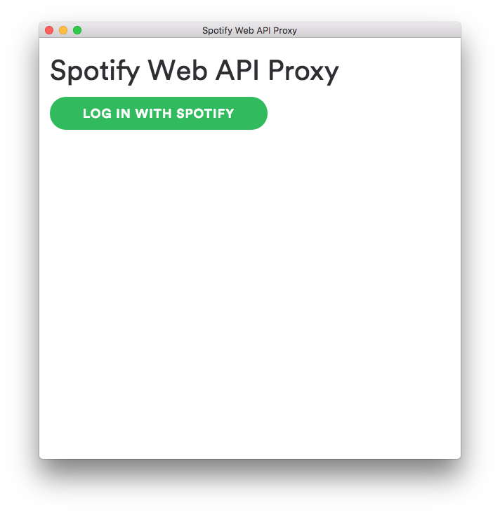
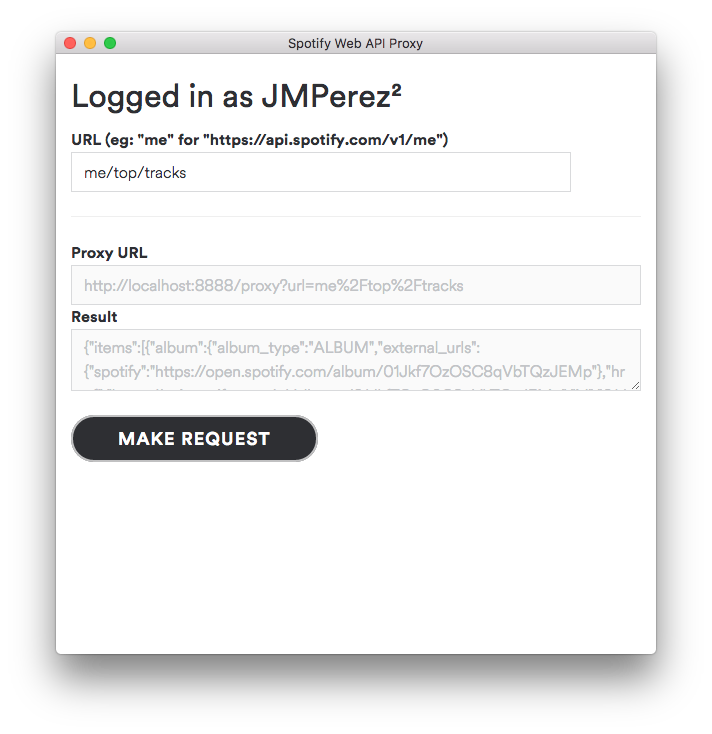

# Spotify's Web API Desktop Proxy

This project provides a desktop application that helps fetching data from the Spotify's Web API, handling authentication and token refreshing for you.

It allows creating prototypes using data from Spotify's Web API, both using public available endpoints (search and look up) and authenticated ones (browse, user's library, user's top tracks) just running a desktop application.

Some [modern design tools](https://medium.com/bridge-collection/modern-design-tools-using-real-data-62d499e97482#.4tdwd67th) like [Framer](https://medium.com/framer-prototyping/prototype-with-real-data-in-framer-from-json-to-multi-device-and-internet-of-things-6eb1ae8b8325) or [Sketch](https://support.invisionapp.com/hc/en-us/articles/209650506-Craft-Introduction-to-the-Data-plugin) are able to work with JSON, binding certain components to fields in the JSON for quick prototyping with real data. Using this proxy you can get plain JSON from Spotify's API or a proxied URL, all without having to care about implementing login nor refreshing tokens from your application.

## Installation

Clone the project and install the dependencies

    $ npm install

## Configuration

You need to create an application on [Spotify's My Applications site](https://developer.spotify.com/my-applications/). Give it a name and a description, and add `http://localhost:8888/callback` as a redirect uri.

Finally, edit the `index.js` file replacing `<client_id>` and `<client_secret>` with those from the application you have just created.

## Running the application

Running the app is easy. Execute:

    $ npm start

Pretty awesome, isn't it? You might want to create an actual executable. For that, run:

    $ npm i electron-packager -g
    $ electron-packager . --platform=darwin

In this case, you will be building an application for mac.

## Using the application

Log in on the application.

Then provide the path for an endpoint from the Web API. For an endpoint like `https://api.spotify.com/v1/me/top/tracks`, type `me/top/tracks` in the url box. You will get a link to localhost that will return the JSON from the request, and you can also make the request and get the output from within the app.

## TODO

As with any other project, there are some things that haven't been done yet:

- Look & Feel: The UI looks a bit ugly at the moment.
- Persistence of user's credentials
- Option to log out
